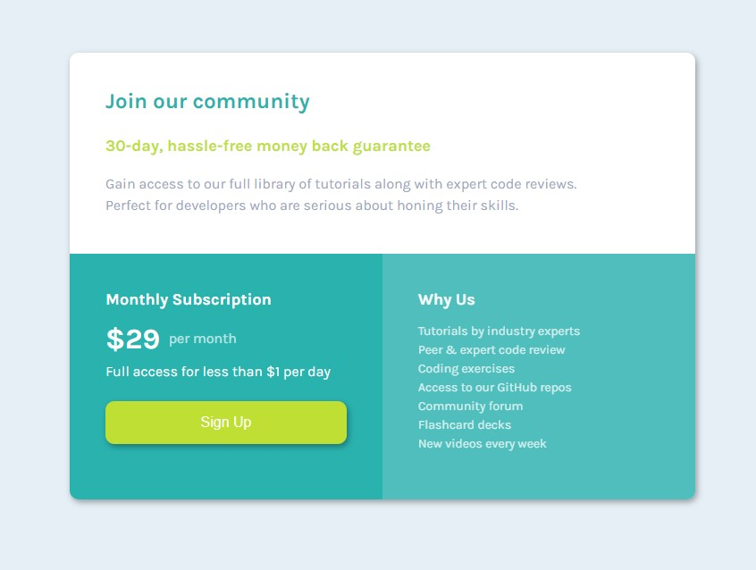

# Frontend Mentor - Single price grid component solution

This is a solution to the [Single price grid component challenge on Frontend Mentor](https://www.frontendmentor.io/challenges/single-price-grid-component-5ce41129d0ff452fec5abbbc). Frontend Mentor challenges help you improve your coding skills by building realistic projects. 

## Table of contents

- [Overview](#overview)
  - [The challenge](#the-challenge)
  - [Screenshot](#screenshot)
- [My process](#my-process)
  - [Built with](#built-with)
  - [What I learned](#what-i-learned)
  - [Continued development](#continued-development)
- [Author](#author)
- [Acknowledgments](#acknowledgments)

## Overview

### The challenge

Users should be able to:

- View the optimal layout for the component depending on their device's screen size
- See a hover state on desktop for the Sign Up call-to-action

### Screenshot



### Links

- Solution URL: [Add solution URL here](https://your-solution-url.com)
- Live Site URL: [Add live site URL here](https://your-live-site-url.com)

## My process

### Built with

- Semantic HTML5 markup
- CSS custom properties
- Flexbox
- CSS Grid
- Mobile-first workflow


### What I learned

- The general basics of design layout
    - using raw CSS
    - using block, inline-block, and flex display elements
    - understanding of relative positions 
    - Introductory understanding of responsive design for mobile devices 

- How to add Google Fonts to my project
- General understanding of how to use CSS shadowing  

I'm proud that I was able to figure out this CSS:

```css
#price-suffix {
    position: relative;
    top: -6px;
    display: inline-block;
    padding-left: 6px;
    opacity: 0.7;
}
```

### Continued development

This solution is a very basic, static Webpage, with only minimum responsive design
features. I'll enhance it going forward to incorporate responsive flex boxes.

## Author
Jeffrey Favret

## Acknowledgments

This exercise was completed in connection with Zach Goll's Frontend Web Develoopment Bootcamp
series at freeCodeCamp.org. 

